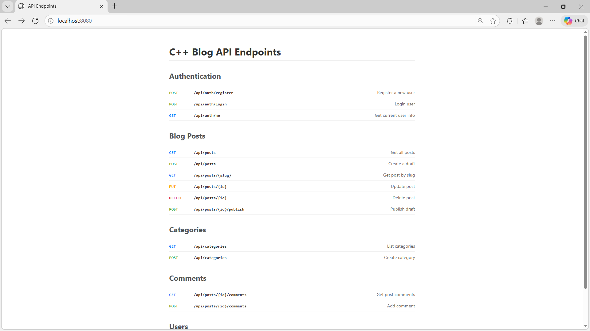

# C++ Blog API

A high-performance REST API built with **C++** and **Drogon Framework**.



## Features

*   **Blazing Fast**: Written in modern C++.
*   **Authentication**: User registration and login (Mock).
*   **Content Management**: CRUD operations for Posts, Categories, and Comments.
*   **User Profiles**: Manage user info.
*   **Dockerized**: Ready to deploy.

---

## API Endpoints

### Authentication

| Method | Endpoint | Description |
| :--- | :--- | :--- |
| `POST` | `/api/auth/register` | Register a new user (`email`, `password`) |
| `POST` | `/api/auth/login` | Login user (`email`, `password`) |
| `GET` | `/api/auth/me` | Get current logged-in user info |

### Blog Posts

| Method | Endpoint | Description |
| :--- | :--- | :--- |
| `GET` | `/api/posts` | Get all published posts |
| `POST` | `/api/posts` | Create a new draft (`title`, `content`) |
| `GET` | `/api/posts/{slug}` | Get a single post by slug |
| `PUT` | `/api/posts/{id}` | Update a post (`title`, `content`, `tags`) |
| `DELETE` | `/api/posts/{id}` | Delete a post |
| `POST` | `/api/posts/{id}/publish` | Publish a draft |

### Categories

| Method | Endpoint | Description |
| :--- | :--- | :--- |
| `GET` | `/api/categories` | List all categories |
| `POST` | `/api/categories` | Create a new category (`name`) |

### Comments

| Method | Endpoint | Description |
| :--- | :--- | :--- |
| `GET` | `/api/posts/{id}/comments` | Get comments for a post |
| `POST` | `/api/posts/{id}/comments` | Add a comment (`content`) |

### Users

| Method | Endpoint | Description |
| :--- | :--- | :--- |
| `GET` | `/api/users/{id}` | Get public user profile |
| `PUT` | `/api/users/{id}` | Update user profile (`bio`) |

---

## How to Run

### Using Docker (Recommended)

```bash
# Build the image
docker build -t blog_api .

# Run the container
docker run -d -p 8080:8080 --name blog_api blog_api
```

### Manual Build (Local)

To run without Docker, you need **CMake** and a C++ compiler. You also need to install the **Drogon** library.

#### Windows (using vcpkg)

1.  **Install dependencies**:
    ```powershell
    # Assuming you have vcpkg installed
    vcpkg install drogon:x64-windows
    ```

2.  **Build**:
    ```powershell
    mkdir build
    cd build
    # Replace path to your vcpkg.cmake
    cmake .. -DCMAKE_TOOLCHAIN_FILE=C:/vcpkg/scripts/buildsystems/vcpkg.cmake
    cmake --build . --config Release
    ```

3.  **Run**:
    ```powershell
    cd Release
    .\blog_api.exe
    ```

#### Linux / WSL

1.  **Install dependencies**:
    ```bash
    sudo apt install git cmake g++ libjsoncpp-dev uuid-dev zlib1g-dev libssl-dev
    # Install Drogon (source)
    git clone https://github.com/drogonframework/drogon
    cd drogon && mkdir build && cd build
    cmake .. && make && sudo make install
    ```

2.  **Build & Run**:
    ```bash
    mkdir build && cd build
    cmake ..
    make
    ./blog_api
    ```

---

## Testing with Postman

Import the `postman_collection.json` file included in this repository to test all endpoints instantly!
