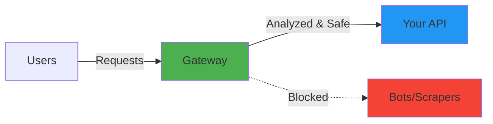

# AI-Powered API Abuse Detection Gateway

**Protect your APIs from bots, scrapers, and DDoS attacks with real-time ML-powered behavioral analysis.**

!!! success "Production Ready"
 Thread-safe | ML-powered | Zero backend changes | Real-time protection

## What is this?

A **C++ high-performance gateway** that sits in front of your API and automatically detects and blocks abusive traffic using machine learning and behavioral analysis.



## Key Features

- ** Zero Code Changes** - No modification to your existing API
- ** AI-Powered Detection** - Machine learning identifies attack patterns
- ** High Performance** - C++20 with < 5ms latency overhead
- ** Thread-Safe** - Handles thousands of concurrent requests
- ** Real-time Dashboard** - Monitor traffic and threats live
- ** Three-tier Enforcement** - Allow, Throttle, or Block
- ** Auto-Expiring Bans** - Temporary blocks that expire automatically

## Quick Example

**Before (Vulnerable):**
```
https://your-api.vercel.app/api/products
```

**After (Protected):**
```
https://your-gateway.com/api/products
```

Your users don't notice any difference. Attackers get blocked automatically.

## How It Works

1. **Client Identification** - Unique fingerprint from IP + User-Agent + Auth token
2. **Behavioral Analysis** - Tracks RPS, burstiness, endpoint diversity, error rates
3. **ML Risk Scoring** - Real-time inference calculates abuse risk (0.0 - 1.0)
4. **Smart Enforcement**:
 - Risk < 0.5: Allow (normal traffic)
 - Risk 0.5-0.8: Throttle (suspicious, add delay)
 - Risk > 0.8: Block + Ban (attack detected)

## Perfect For

- **E-commerce** - Protect against price scrapers
- **Mobile Apps** - Block fake API clients
- **SaaS Platforms** - Prevent credential stuffing
- **Web APIs** - Stop content theft
- **Microservices** - Internal service protection

## Real-World Example

**sans's Story:**

sans built a beautiful e-commerce website with Next.js frontend and Node.js backend, deployed on Vercel. After launch, she noticed:

- Her product API was being scraped 1000x/minute
- Server costs jumped 400%
- Real customers got slow responses

**Solution:** She deployed this gateway in 10 minutes. Now:

 Bots are automatically blocked 
 Server costs back to normal 
 Real customers have fast access 
 She has analytics dashboard to monitor everything

[See her complete setup guide →](use-cases/vercel-integration.md)

## Quick Start

```bash
# 1. Clone the repo
git clone https://github.com/yourusername/AI-Gateway.git
cd AI-Gateway

# 2. Build with Docker
docker build -t api-gateway .

# 3. Run (protecting example.com)
docker run -d -p 8080:8080 \
 -e BACKEND_URL=https://your-api.vercel.app \
 api-gateway

# 4. Open dashboard
open http://localhost:8080/dashboard/index.html
```

**That's it!** Your API is now protected.

## Support & Community

- [Full Documentation](getting-started/quickstart.md)
- [GitHub Issues](https://github.com/yourusername/AI-Gateway/issues)
- [Star on GitHub](https://github.com/yourusername/AI-Gateway)
- [Contributing Guide](contributing.md)

## License

MIT License - Use freely in your projects!

---

**Ready to protect your API?** → [Get Started](getting-started/quickstart.md)
